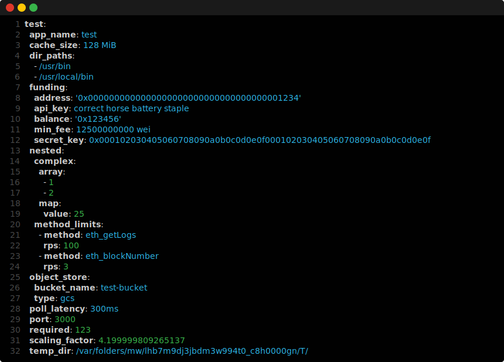

# Command-Line Extensions for `smart-config`

[](https://github.com/matter-labs/smart-config/actions/workflows/ci.yml)
[](https://github.com/matter-labs/smart-config#license)


**Docs:**
[](https://matter-labs.github.io/smart-config/smart_config_commands/)

This library provides a couple of command-line extensions for the [`smart-config`] library:

- Printing help for configuration params with optional filtering.
- Debugging param values and deserialization errors.

## Usage

Add this to your `Crate.toml`:
<!--- x-release-please-start-version -->
```toml
[dependencies]
smart-config-commands = "0.3.0-pre"
```
<!--- x-release-please-end -->

### Printing help on config params

```rust
use std::io;
use smart_config::ConfigSchema;
use smart_config_commands::Printer;

let mut schema = ConfigSchema::default();
// Add configurations to the schema...

Printer::stdout().print_help(&schema, |param_ref| {
    // Allows filtering output params.
    param_ref.param.name.contains("test")
})?;
io::Result::Ok(())
```

Example output is as follows:


### Debugging param values

```rust
use std::io;
use smart_config::{ConfigSchema, ConfigRepository};
use smart_config_commands::Printer;

let mut schema = ConfigSchema::default();
// Add configurations to the schema...
let mut repo = ConfigRepository::new(&schema);
// Add sources to the repo...

Printer::stdout().print_debug(&repo, |_| true)?;
io::Result::Ok(())
```

Example output is as follows:


The output will contain deserialization errors for all available params:


### Outputting JSON / YAML

The library can fancy-print JSON and YAML. This be used together with `smart-config` tooling to produce default / example configs,
diffs with default param values etc. See [the example](examples/cli.rs) for a couple of use cases.



## License

Distributed under the terms of either

- Apache License, Version 2.0, ([LICENSE-APACHE](LICENSE-APACHE) or http://www.apache.org/licenses/LICENSE-2.0)
- MIT license ([LICENSE-MIT](LICENSE-MIT) or http://opensource.org/licenses/MIT)

at your option.

[`smart-config`]: ../smart-config
