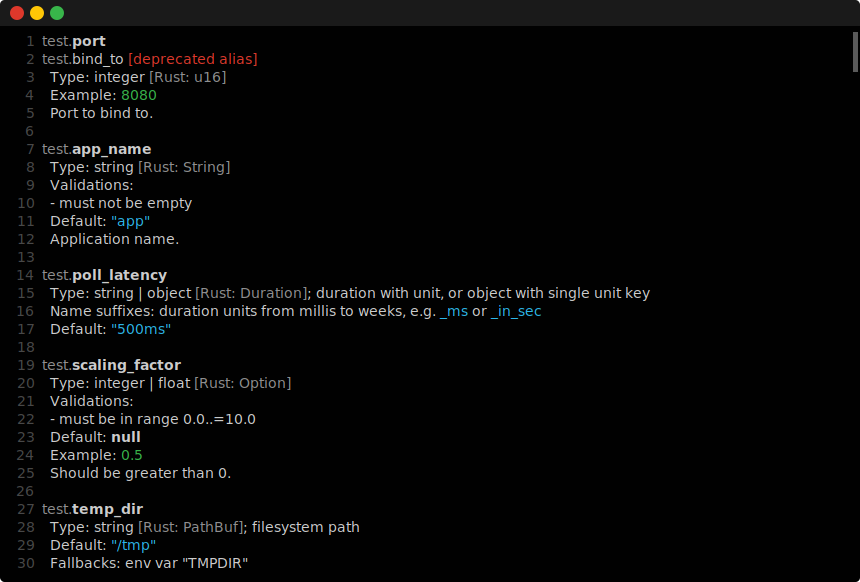

# Command-Line Extensions for `smart-config`

This library provides a couple of command-line extensions for the [`smart-config`] library:

- Printing help for configuration params with optional filtering.
- Debugging param values and deserialization errors.

## Usage

Add this to your `Crate.toml`:

```toml
[dependencies]
smart-config-commands = "0.1.0"
```

### Printing help on config params



### Debugging param values


The output will contain deserialization errors for all available params:


## License

Distributed under the terms of either

- Apache License, Version 2.0, ([LICENSE-APACHE](LICENSE-APACHE) or http://www.apache.org/licenses/LICENSE-2.0)
- MIT license ([LICENSE-MIT](LICENSE-MIT) or http://opensource.org/licenses/MIT)

at your option.

[`smart-config`]: ../smart-config
